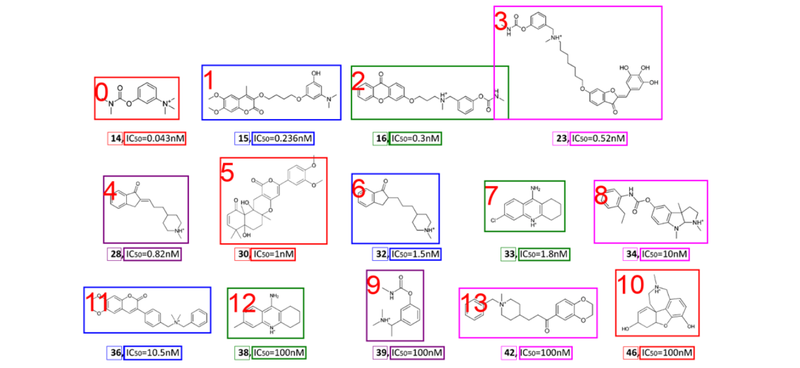

# CarsiChemIE

## Molecule detection
### the result of molecule detection

<table>
    <tr>
        <th>Model</th>
        <th>IOU@50% Precision</th>
        <th>IOU@50% Recall</th>
        <th>IOU@75% Precision</th>
        <th>IOU@75% Recall</th>
        <th>IOU@90% Precision</th>
        <th>IOU@90% Recall</th>
    </tr>
    <tr>
        <td>DECERMER</td>
        <td>0.852</td>
        <td>0.907</td>
        <td>0.374</td>
        <td>0.578</td>
        <td>0.004</td>
        <td>0.007</td>
    </tr>
    <tr>
        <td>MolCoref</td>
        <td>0.820</td>
        <td>0.895</td>
        <td>0.539</td>
        <td>0.710</td>
        <td>0.009</td>
        <td>0.058</td>
    </tr>
    <tr>
        <td>yolo</td>
        <td class="best">0.987</td>
        <td class="best">0.992</td>
        <td>0.678</td>
        <td>0.720</td>
        <td>0.004</td>
        <td>0.029</td>
    </tr>
    <tr>
        <td>Ours</td>
        <td>0.920</td>
        <td>0.950</td>
        <td class="best">0.898</td>
        <td class="best">0.933</td>
        <td class="best">0.828</td>
        <td class="best">0.891</td>
    </tr>
    <tr>
        <td>Ours(+yolo)</td>
        <td class="best">0.962</td>
        <td class="best">0.992</td>
        <td class="best">0.928</td>
        <td class="best">0.972</td>
        <td class="best">0.914</td>
        <td class="best">0.966</td>
    </tr>
</table>

### the result accurancy of match of index and molecule

<table>
    <tr>
        <th>Model</th>
        <th>IOU@50% Precision</th>
        <th>IOU@50% Recall</th>
        <th>IOU@75% Precision</th>
        <th>IOU@75% Recall</th>
        <th>IOU@90% Precision</th>
        <th>IOU@90% Recall</th>
    </tr>
    <tr>
        <td>MolCoref</td>
        <td>0.991</td>
        <td>0.752</td>
        <td>0.993</td>
        <td>0.669</td>
        <td class="best">1.000</td>
        <td>0.042</td>
    </tr>
    <tr>
        <td>Ours</td>
        <td class="best">1.000</td>
        <td>0.727</td>
        <td class="best">1.000</td>
        <td>0.583</td>
        <td class="best">1.000</td>
        <td>0.020</td>
    </tr>
    <tr>
        <td>Ours(+yolo)</td>
        <td class="best">1.000</td>
        <td class="best">0.935</td>
        <td class="best">1.000</td>
        <td class="best">0.899</td>
        <td class="best">1.000</td>
        <td class="best">0.939</td>
    </tr>
</table>

### visualization
<table style="width: 100%; border-collapse: collapse;">
    <tr>
        <td style="text-align: center;">
            
        </td>
        <td style="text-align: center;">
            
        </td>
    </tr>
</table>

> the light box is the `Idtentiter` of molecule, while commen box if `text` or `molecule` of moleclue.

## Molecule Structure Recognization

### The Result of Molecule Structure Recognization
<table>
    <tr>
        <th>Model</th>
        <th>Synthetic</th>
        <th></th>
        <th>Realistic</th>
        <th></th>
        <th></th>
        <th></th>
        <th>Pertubed</th>
        <th></th>
        <th></th>
        <th></th>
        <th></th>
    </tr>
    <tr>
        <th></th>
        <th>Indigo</th>
        <th>ChemDraw</th>
        <th>USPTO</th>
        <th>Staker</th>
        <th>CLEF</th>
        <th>UOB</th>
        <th>CLEF_p</th>
        <th>UOB_p</th>
        <th>USPTO_p</th>
        <th>Staker_p</th>
    </tr>
    <tr>
        <td>OSRA*</td>
        <td class="best">95.00</td>
        <td>87.30</td>
        <td>87.40</td>
        <td>0.00</td>
        <td>84.60</td>
        <td>78.50</td>
        <td>55.30</td>
        <td>11.50</td>
        <td>68.30</td>
        <td>4.00</td>
        <td>0.00</td>
    </tr>
    <tr>
        <td>MolScibe</td>
        <td>97.50</td>
        <td>93.80</td>
        <td>92.60</td>
        <td class="best">86.90</td>
        <td class="best">88.90</td>
        <td>87.90</td>
        <td>71.90</td>
        <td class="best">90.40</td>
        <td class="best">86.70</td>
        <td class="best">92.50</td>
        <td>65.00</td>
    </tr>
    <tr>
        <td>Ours</td>
        <td class="best">98.59</td>
        <td class="best">97.02</td>
        <td class="best">94.78</td>
        <td>88.21</td>
        <td>93.70</td>
        <td class="best">90.26</td>
        <td class="best">81.91</td>
        <td class="best">90.04</td>
        <td class="best">89.09</td>
        <td class="best">94.67</td>
        <td>69.81</td>
    </tr>
</table>

### visualization
<table style="width: 100%; border-collapse: collapse;">
    <tr>
        <td style="text-align: center;">
            
        </td>
        <td style="text-align: center;">
            
        </td>
    </tr>
</table>

> the red box here is that much error (especially the recognition of chiral bonds) in molecule recoginazation.

## the result of table detection
<table>
    <tr>
        <th>Model</th>
        <th>IOU@50% Precision</th>
        <th>IOU@50% Recall</th>
        <th>IOU@75% Precision</th>
        <th>IOU@75% Recall</th>
        <th>IOU@90% Precision</th>
        <th>IOU@90% Recall</th>
    </tr>
    <tr>
        <td>DETR</td>
        <td>0.807</td>
        <td>0.818</td>
        <td>0.665</td>
        <td>0.712</td>
        <td>0.112</td>
        <td>0.246</td>
    </tr>
    <tr>
        <td>Ours</td>
        <td class="best">0.961</td>
        <td class="best">0.996</td>
        <td class="best">0.926</td>
        <td class="best">0.975</td>
        <td class="best">0.762</td>
        <td class="best">0.881</td>
    </tr>
</table>

## the result of table structure recoginization (cell level)
<table>
    <tr>
        <th>Model</th>
        <th>IOU@50% Precision</th>
        <th>IOU@50% Recall</th>
        <th>IOU@75% Precision</th>
        <th>IOU@75% Recall</th>
        <th>IOU@90% Precision</th>
        <th>IOU@90% Recall</th>
    </tr>
    <tr>
        <td>DETR</td>
        <td>0.455</td>
        <td>0.560</td>
        <td>0.118</td>
        <td>0.163</td>
        <td>0.009</td>
        <td>0.062</td>
    </tr>
    <tr>
        <td>Ours</td>
        <td class="best"><b>0.772</b></td>
        <td class="best"><b>0.777</b></td>
        <td class="best"><b>0.759</b></td>
        <td class="best"><b>0.775</b></td>
        <td class="best"><b>0.731</b></td>
        <td class="best"><b>0.759</b></td>
    </tr>
</table>

### visulization

## the result of ocr
<table>
    <tr>
        <th>model</th>
        <th>CER</th>
    </tr>
    <tr>
        <td>easyocr</td>
        <td>0.2259</td>
    </tr>
    <tr>
        <td>docTR</td>
        <td>0.3410</td>
    </tr>
    <tr>
        <td>tesseract</td>
        <td>0.2435</td>
    </tr>
    <tr>
        <td>LatexOCR(ours)</td>
        <td><b>0.0384</b></td>
    </tr>
</table>

> our ocr model based LatexOCR from <a href="https://github.com/OleehyO/TexTeller">Texteller</a> to read `latex code` from image because there are various formats in chemical texts, such as **superscripts**, **subscripts**, and **unconventional characters**, we finetuned this model and add some postprocess such as <a href="https://pylatexenc.readthedocs.io/en/latest/latex2text/">`latex2text`</a> to convert 

### visualization

