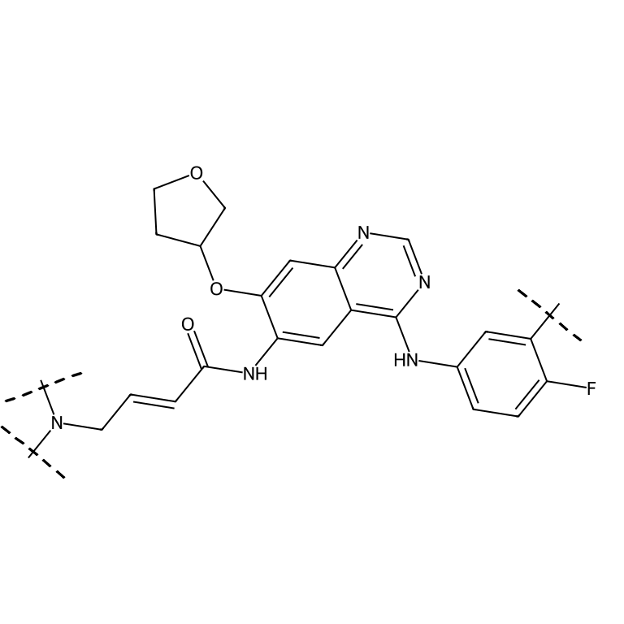
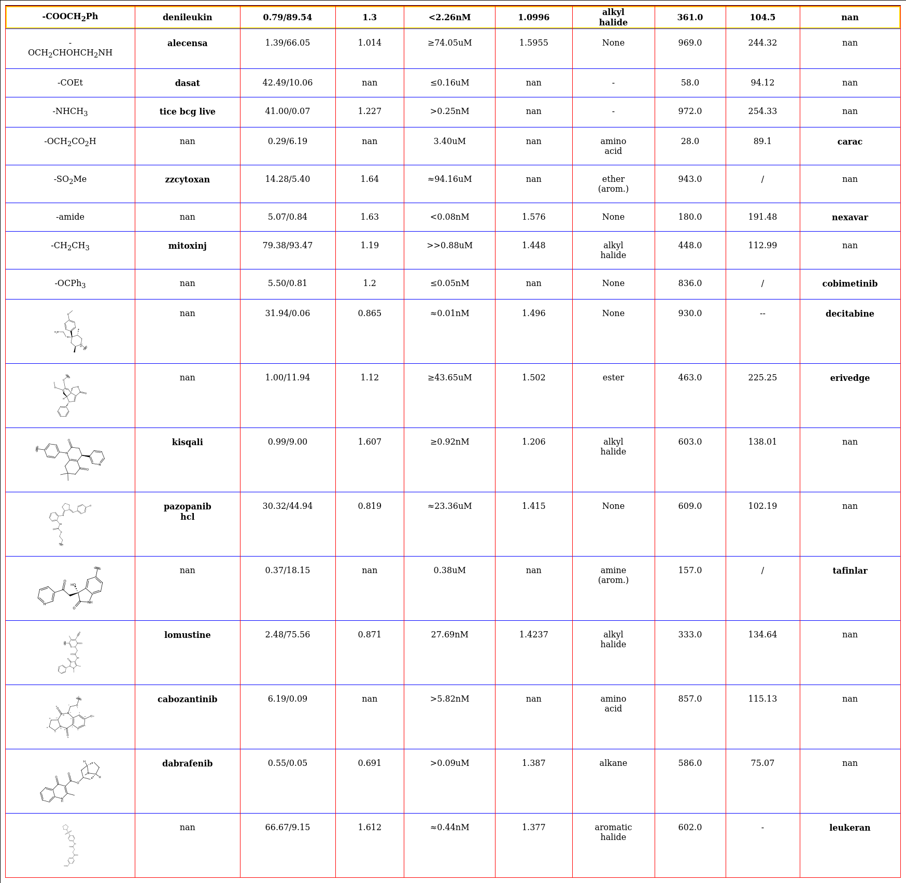

## sythesis of detection of molecule and corefs
### workflow

### cmd

### visualization


## sythesis of the structure of `Markush Molecule` 
### workflow

</img>

* First, it generate random smiles using rdkit, and random add `extention` to smiles to generate the `CXSmiles` which is
* Then, the `CXSmiles` is fed to CDK to generation of MolBlock of `Markush Structure`. 
* Last, the MolBlock of `Markush Structure` fed into `rdkit` or `indigo` to generate the image and keep the `atom symbol`(or some funtional group) and their coordinates 

### Installation
CDK needs `scyjava` which can be implement in python.
scyjava installation
```bash
conda install conda-forge::scyjava
```
Attention!!! **It needs `java` in environment**!!!

### cmd
```python
python syn_markush.py
```

### result
```md
image (PIL.PngImagePlugin.PngImageFile): image of the structure of Markush Molecule
result_dict (dict):
    ```
    result_dict['0'] = {
        'smiles':'CN(C)C/C=C/C(=O)Nc1cc2c(Nc3ccc(F)c(Cl)c3)ncnc2cc1OC1CCOC1', # the smiles after transformation
        'original_smiles':'CN(C)C\\C=C\\C(=O)Nc3cc1c(Nc(cc2Cl)ccc2F)ncnc1cc3OC4COCC4', # original smiles before transformation
        'markush_type': 'polymer', # the type of markush
        'graph':{
            'smiles'：'CN(C)C/C=C/C(=O)Nc1cc2c(Nc3ccc(F)c(Cl)c3)ncnc2cc1OC1CCOC1', ## the smiles after transformation
            'coords':[[303.91110661452615, 34.90909090909083], [338.1180947258228, 78.67754741169942], [393.1260890716628, 70.9377026496563], [317.31708849127943, 130.18584867635107], [351.5240766025761, 173.9543051789597], [330.7230703680327, 225.4626064436113], [364.9296402108321, 269.23074775829974], [419.9376345566721, 261.4909029962567], [344.1286339762887, 320.7390490229514], [378.3356220875854, 364.50750552556], [357.5312439448979, 416.04769430580666], [391.73609711497596, 459.8568398010203], [370.9317189722884, 511.397028581267], [315.92248765952286, 519.1280718663002], [295.1131616491329, 570.6330547385066], [329.32509762813197, 614.4367171491554], [308.529039261291, 665.9802243218471], [253.52104491545103, 673.7200690838904], [232.71171890506108, 725.2250519560969], [219.30910893645196, 629.9164066732415], [164.30111459061197, 637.6562514352845], [240.1051673032929, 578.3728995005497], [405.13657214236656, 555.2061740764807], [460.1458034551321, 547.4751307914478], [480.95018159781966, 495.93494201120103], [446.7453284277416, 452.12579651598736], [467.5497065704291, 400.58560773574067], [433.344853400351, 356.7764622405269], [454.1624991865875, 305.2747977607655], [509.17296746627875, 297.5525559527425], [535.2816458718689, 248.52082435593084], [589.704882222693, 258.20049109189733], [597.7361550115075, 313.2438181312804], [547.5829492797589, 337.30511319274297]], # the absolute 2d coordinates of atom (or some funtion group) in image
            'symbols':['C', 'N', 'C', 'C', 'C', 'C', 'C', 'O', 'N', 'C', 'C', 'C', 'C', 'N', 'C', 'C', 'C', 'C', 'F', 'C', 'Cl', 'C', 'N', 'C', 'N', 'C', 'C', 'C', 'O', 'C', 'C', 'C', 'O', 'C'], #the symbols of atom (or some funtion group)
            'symbols_rdkit': ['C', 'N', 'C', 'C', 'C', 'C', 'C', 'O', 'N', 'C', 'C', 'C', 'C', 'N', 'C', 'C', 'C', 'C', 'F', 'C', 'Cl', 'C', 'N', 'C', 'N', 'C', 'C', 'C', 'O', 'C', 'C', 'C', 'O', 'C'], #the symbols of atom (or some funtion group) in rdkit, specifically some funtion group will be replaced by `R`
            'edges': array([[0, 1, 0, ..., 0, 0, 0],
                            [1, 0, 1, ..., 0, 0, 0],
                            [0, 1, 0, ..., 0, 0, 0],
                            ...,
                            [0, 0, 0, ..., 0, 1, 0],
                            [0, 0, 0, ..., 1, 0, 1],
                            [0, 0, 0, ..., 0, 1, 0]]), # the `adjacency matrix` of molecule 
            'num_atoms': 34,
            'rdkit_smiles':'CN(C)C/C=C/C(=O)Nc1cc2c(Nc3ccc(F)c(Cl)c3)ncnc2cc1OC1CCOC1',  # the smiles after transformation in rdkit, specifically some funtion group will be replaced by `R`
            'extention': 'Sg:n:31:n:ht', #the extension of CXsmiles
            'molblock':'\n     RDKit          2D\n\n  0  0  0  0  0  0  0  0  0  0999 V3000\nM  V30 BEGIN CTAB\nM  V30 COUNTS 34 37 1 0 0\nM  V30 BEGIN ATOM\nM  V30 1 C -11.693150 -1.501460 0.000000 0\nM  V30 2 N -10.394230 -0.751250 0.000000 0\nM  V30 3 C -10.394470 0.748750 0.000000 0\nM  V30 4 C -9.095070 -1.501040 0.000000 0\nM  V30 5 C -7.796150 -0.750830 0.000000 0\nM  V30 6 C -6.496990 -1.500620 0.000000 0\nM  V30 7 C -5.198080 -0.750420 0.000000 0\nM  V30 8 O -5.198320 0.749580 0.000000 0\nM  V30 9 N -3.898920 -1.500210 0.000000 0\nM  V30 10 C -2.600000 -0.750000 0.000000 0\nM  V30 11 C -1.300000 -1.500000 0.000000 0\nM  V30 12 C 0.000000 -0.750000 0.000000 0\nM  V30 13 C 1.300000 -1.500000 0.000000 0\nM  V30 14 N 1.300000 -3.000000 0.000000 0\nM  V30 15 C 2.599040 -3.750000 0.000000 0\nM  V30 16 C 3.898920 -2.999790 0.000000 0\nM  V30 17 C 5.199040 -3.749580 0.000000 0\nM  V30 18 C 5.199280 -5.249580 0.000000 0\nM  V30 19 F 6.498320 -5.999580 0.000000 0\nM  V30 20 C 3.899400 -5.999790 0.000000 0\nM  V30 21 Cl 3.899640 -7.499790 0.000000 0\nM  V30 22 C 2.599280 -5.250000 0.000000 0\nM  V30 23 N 2.600000 -0.750000 0.000000 0\nM  V30 24 C 2.600000 0.750000 0.000000 0\nM  V30 25 N 1.300000 1.500000 0.000000 0\nM  V30 26 C 0.000000 0.750000 0.000000 0\nM  V30 27 C -1.300000 1.500000 0.000000 0\nM  V30 28 C -2.600000 0.750000 0.000000 0\nM  V30 29 O -3.898920 1.500210 0.000000 0\nM  V30 30 C -3.898680 3.000210 0.000000 0\nM  V30 31 C -5.111670 3.882620 0.000000 0\nM  V30 32 C -4.648310 5.301520 0.000000 0\nM  V30 33 O -3.146270 5.309420 0.000000 0\nM  V30 34 C -2.691350 3.877900 0.000000 0\nM  V30 END ATOM\nM  V30 BEGIN BOND\nM  V30 1 1 1 2\nM  V30 2 1 2 3\nM  V30 3 1 2 4\nM  V30 4 1 4 5\nM  V30 5 2 5 6\nM  V30 6 1 6 7\nM  V30 7 2 7 8\nM  V30 8 1 7 9\nM  V30 9 1 9 10\nM  V30 10 2 10 11\nM  V30 11 1 11 12\nM  V30 12 2 12 13\nM  V30 13 1 13 14\nM  V30 14 1 14 15\nM  V30 15 2 15 16\nM  V30 16 1 16 17\nM  V30 17 2 17 18\nM  V30 18 1 18 19\nM  V30 19 1 18 20\nM  V30 20 1 20 21\nM  V30 21 2 20 22\nM  V30 22 1 15 22\nM  V30 23 1 13 23\nM  V30 24 2 23 24\nM  V30 25 1 24 25\nM  V30 26 2 25 26\nM  V30 27 1 12 26\nM  V30 28 1 26 27\nM  V30 29 2 27 28\nM  V30 30 1 10 28\nM  V30 31 1 28 29\nM  V30 32 1 29 30\nM  V30 33 1 30 31\nM  V30 34 1 31 32\nM  V30 35 1 32 33\nM  V30 36 1 33 34\nM  V30 37 1 30 34\nM  V30 END BOND\nM  V30 BEGIN SGROUP\nM  V30 1 SRU 0 ATOMS=(1 32) XBONDS=(2 34 35) LABEL=n -\nM  V30 BRKXYZ=(9 -5.5205 4.8051 0 -4.2372 4.3860 0 0 0 0) BRKXYZ=(9 -3.9019 5.-\nM  V30 9805 0 -3.8948 4.6305 0 0 0 0)\nM  V30 END SGROUP\nM  V30 END CTAB\nM  END\n' # the molblock of markush molecule

        }
    }
    
    ```

```

### visualization

<a src="visualization_for_mol_structure.ipynb">notebook</a>

<div style="text-align: center;">
    <table style="margin: auto; border-collapse: collapse;">
        <thead>
            <tr>
                <th>Markush Type</th>
                <th>Original Image</th>
                <th>Visualization</th>
            </tr>
        </thead>
        <tbody>
            <tr>
                <td>Normal Molecule</td>
                <td></td>
                <td></td>
            </tr>
            <tr>
                <td>Rgroup(dash)</td>
                <td></td>
                <td></td>
            </tr>
            <tr>
                <td>Rgroup(dash line)</td>
                <td></td>
                <td></td>
            </tr>
            <tr>
                <td>Rgroup(wave_line)</td>
                <td></td>
                <td></td>
            </tr>
            <tr>
                <td>uncertainty_position_v1</td>
                <td></td>
                <td></td>
            </tr>
            <tr>
                <td>uncertainty_position_v1(indigo)</td>
                <td></td>
                <td></td>
            </tr>
            <tr>
                <td>uncertainty_position_v2</td>
                <td></td>
                <td></td>
            </tr>
            <tr>
                <td>uncertainty_position_v2(indigo)</td>
                <td></td>
                <td></td>
            </tr>
            <tr>
                <td>polymer</td>
                <td></td>
                <td></td>
            </tr>
        </tbody>
    </table>
</div>


## Systhesis of the structure of table

## Purple
The main purples of `Systhesis of the structure of table` is to inject the information of molecule structure to table, to hanle the bad case of recognization that spliting the molecule.

bad case in prediction of <a href="https://github.com/microsoft/table-transformer">`table transformer`</a>.
<table>
    <thead>
        <tr>
            <th>Original Image</th>
            <th>Predition of table transformer</th>
        </tr>
    </thead>
    <tbody>
        <tr>
            <td></td>
            <td></td>
        </tr>
        <tr>
            <td></td>
            <td></td>
        </tr>
    </tbody>
</table>


### Workflow


* First, random generation of the html of table. 
* Then, generation `bordered table` and `boderless table` with `wkhtmltox`
* Then, labeling the `bordered table` with <a href="https://github.com/xavctn/img2table">`img2table`</a> which is good at recogination of `bordered table`; and then random keep 1 image of `bordered table` and `borderless table` .

### Installation
* imgkit: wkhtmltox
```bash
pip install imgkit
sudo apt-get -y install wkhtmltopdf
```

* rdkit
```bash
pip install rdkit==2023.3.2
```

### cmd
```bash
python syn_table_structure_simple.py
``` 

### visualization
<html lang="en">
<head>
    <meta charset="UTF-8">
    <meta name="viewport" content="width=device-width, initial-scale=1.0">
    <title>Centered Table with Images</title>
    <style>
        body {
            display: flex;
            justify-content: center;
            align-items: center;
            flex-direction: column;
            margin: 20px;
        }
        table {
            border-collapse: collapse;
            margin-top: 20px;
            text-align: center; /* Center text in cells */
        }
        th, td {
            border: 1px solid #ddd;
            padding: 8px;
        }
        /* th {
            background-color: #f2f2f2;
        } */
        img {
            width: 100px; /* Adjust the size as needed */
            height: auto;
        }
    </style>
</head>
<body>
    <table>
        <thead>
            <tr>
                <th>Type</th>
                <th>Image</th>
                <th>Label</th>
            </tr>
        </thead>
        <tbody>
            <tr>
                <td>Borderless Table</td>
                <td></td>
                <td></td>
            </tr>
            <tr>
                <td>Bordered Table</td>
                <td></td>
                <td></td>
            </tr>
        </tbody>
    </table>
</body>
</html>

> blue: columns;
> red: row;
> gold: row header;


## Systhesis of the detetion of table
This code is very simple. It directly uses the data in `Systhesis of the structure of table`. And then, we training with data below.
# Dataset Overview

| Set Type         | Dataset Name                       | Number of Samples |
|------------------|------------------------------------|-------------------|
| Training Set     | DocLayNet                          | 80,863            |
| Training Set     | pubtables-1m-Detection_train       | 460,589           |
| Training Set     | TableBank                          | 278,582           |
| Training Set     | In-house Dataset                   | 300,000           |
| Validation Set   | pubtables-1m-Detection_val         | 57,591            |
| Test Set         | pubtables-1m-Detection_test        | 57,125            |


## format transformation
### coco2yolo
<a src="./coco2yolo.py">coco2yolo</a>
<div></div>

```bash
python coco2yolo.py --json_path /path/of/coco --save_path path/to/save/yolo_label
```

### labelme2coco
It can refer to <a src="https://github.com/fcakyon/labelme2coco">labelme2coco</a>.

```bash
pip install -U labelme2coco
```

```python
# import package
import labelme2coco

# set directory that contains labelme annotations and image files
labelme_folder = "tests/data/labelme_annot"

# set export dir
export_dir = "tests/data/"

# set train split rate
train_split_rate = 0.85

# set category ID start value
category_id_start = 1

# convert labelme annotations to coco
labelme2coco.convert(labelme_folder, export_dir, train_split_rate, category_id_start=category_id_start)
```

## coco2MolDetect
The format of `MolDetect` refers to <a src="https://github.com/Ozymandias314/MolDetect/tree/main">labelme2coco</a>.

```bash
python coco2moldetect.py --coco_data_path /path/of/coco_data
```
